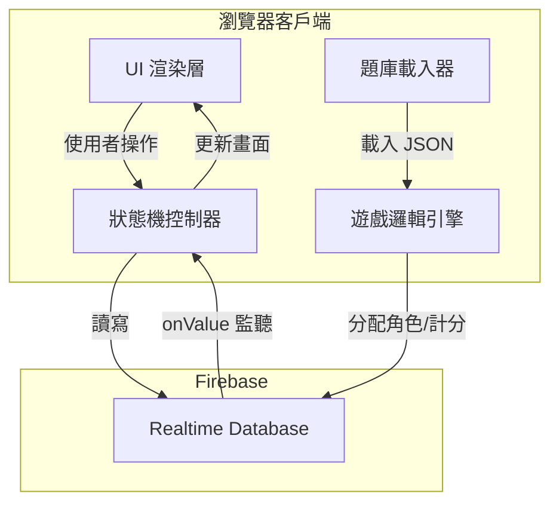
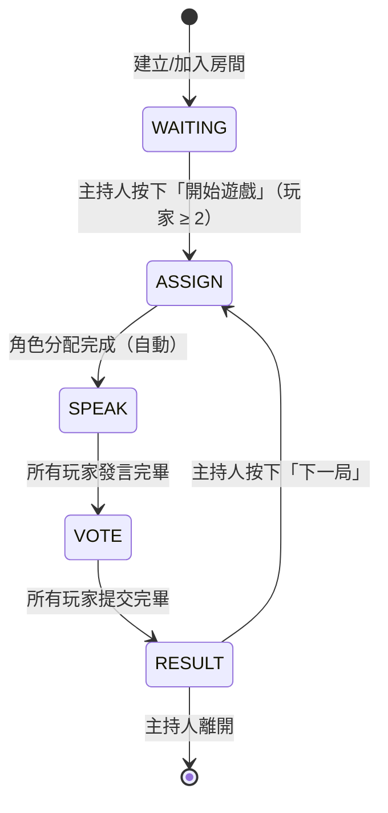

# 技術設計文件：盲人摸象（Blind Elephant Game）

## 概覽（Overview）

「盲人摸象」是一款基於瀏覽器的多人派對遊戲，採用純前端技術（HTML / CSS / Vanilla JavaScript）搭配 Firebase Realtime Database 實現即時多人同步。遊戲透過唯一房間 ID 讓玩家加入同一場次，並由狀態機驅動五個遊戲階段：WAITING → ASSIGN → SPEAK → VOTE → RESULT。

### 技術選型

| 技術 | 用途 |
|------|------|
| HTML / CSS / Vanilla JavaScript | 前端 UI 與遊戲邏輯 |
| Firebase Realtime Database | 即時資料同步（唯一資料來源） |
| Vite | 開發工具與打包 |
| GSAP（可選） | 動畫效果 |

### 設計原則

- **Firebase 作為唯一真實來源**：所有遊戲狀態皆存於 Firebase，客戶端只負責讀取與渲染。
- **狀態機驅動 UI**：前端根據 `rooms/{roomId}/state` 的值切換對應畫面，不維護本地狀態機。
- **最小權限原則**：每位玩家只能讀取自己的角色資訊（提示詞或答案），投票結果在所有人提交前隱藏。

---

## 架構（Architecture）

### 整體架構圖



### 遊戲狀態機



### 模組職責

| 模組 | 檔案 | 職責 |
|------|------|------|
| 進入點 | `src/main.js` | 初始化 Firebase、載入題庫、掛載路由 |
| Firebase 服務 | `src/firebase.js` | 封裝所有 Firebase 讀寫操作 |
| 遊戲邏輯 | `src/game.js` | 角色分配、計分、狀態轉換 |
| 題庫管理 | `src/questionBank.js` | 載入與驗證 JSON 題庫 |
| UI 控制器 | `src/ui.js` | 根據狀態渲染對應畫面 |
| 題庫資料 | `public/questions.json` | 外掛題庫 JSON |

---

## 元件與介面（Components and Interfaces）

### 1. Firebase 服務層（`src/firebase.js`）

封裝所有 Firebase 操作，提供以下介面：

```javascript
// 房間管理
createRoom(playerName) → Promise<{ roomId, playerId }>
joinRoom(roomId, playerName) → Promise<{ playerId }> | throws RoomNotFoundError
leaveRoom(roomId, playerId) → Promise<void>

// 狀態監聽
onRoomStateChange(roomId, callback) → unsubscribe()
onPlayersChange(roomId, callback) → unsubscribe()
onRoundDataChange(roomId, callback) → unsubscribe()

// 遊戲操作
setRoomState(roomId, state) → Promise<void>
writeRoundData(roomId, roundData) → Promise<void>
submitVote(roomId, playerId, targetId) → Promise<void>
submitAnswerGuess(roomId, playerId, guess) → Promise<void>
submitLiarGuess(roomId, playerId, guess) → Promise<void>
updateScore(roomId, playerId, delta) → Promise<void>
```

### 2. 遊戲邏輯引擎（`src/game.js`）

```javascript
// 角色分配
assignRoles(players) → { liars: string[], blinds: string[] }
// 規則：每 4 位玩家 1 位騙子，最少 1 位騙子

// 題目選取
selectQuestion(questionBank, usedQuestions) → Question | null
// 回傳 null 表示題庫已用盡

// 提示詞分配（循環）
assignPrompts(blindPlayers, prompts) → Map<playerId, prompt>

// 計分
calculateScores(votes, liars, answerGuesses, liarGuesses)
  → Map<playerId, scoreDelta>
```

### 3. 題庫載入器（`src/questionBank.js`）

```javascript
loadQuestions(url) → Promise<Question[]> | throws QuestionBankError

// Question 型別
{
  answer: string,
  prompts: string[]
}
```

### 4. UI 控制器（`src/ui.js`）

根據 `state` 值渲染對應的畫面區塊：

```javascript
renderWaiting(roomId, players, isHost)
renderAssign(role, content)   // content = answer 或 prompt
renderSpeak(currentSpeaker, selfRole, selfContent, isHost)
renderVote(players, selfRole, selfId)
renderResult(resultData, scores, isHost)
```

### 5. 畫面路由

單頁應用（SPA），以 `div` 切換顯示，不使用 URL 路由：

```
#screen-home      → 建立/加入房間
#screen-waiting   → 等待大廳
#screen-assign    → 角色揭示
#screen-speak     → 發言階段
#screen-vote      → 投票階段
#screen-result    → 結算畫面
```

---

## 資料模型（Data Models）

### Firebase Realtime Database 結構

```
rooms/
  {roomId}/
    state: "WAITING" | "ASSIGN" | "SPEAK" | "VOTE" | "RESULT"
    hostId: string
    players/
      {playerId}/
        name: string
        score: number
        role: "liar" | "blind" | null
        connected: boolean
    currentRound/
      answer: string
      speakerIndex: number
      speakerOrder: string[]        // playerId 陣列，決定發言順序
      usedQuestions: string[]       // 已使用題目的 answer 字串陣列
      prompts/
        {playerId}: string
      votes/
        {playerId}: string          // 投票目標的 playerId
      liarGuesses/
        {playerId}: string          // 騙子的預想答案
      answerGuesses/
        {playerId}: string          // 瞎子的猜測答案
```

### 本地（記憶體）資料結構

```javascript
// 玩家本地 session（存於 sessionStorage）
{
  roomId: string,
  playerId: string,
  playerName: string
}

// Question 物件
{
  answer: string,
  prompts: string[]   // 至少 1 個
}

// RoundResult（計算用，不存 Firebase）
{
  revealedLiars: string[],
  voteResults: { [playerId]: string },
  scoreDeltas: { [playerId]: number },
  liarGuessResults: { [liarId]: { guess: string, matched: boolean } }
}
```

### 騙子比例規則

| 玩家人數 | 騙子人數 |
|----------|----------|
| 2–3 | 1 |
| 4–7 | 1 |
| 8–11 | 2 |
| 12+ | floor(n/4) |

> 實作：`Math.max(1, Math.floor(playerCount / 4))`

---

## 正確性屬性（Correctness Properties）

*屬性（Property）是指在系統所有有效執行中都應成立的特性或行為——本質上是對系統應做什麼的正式陳述。屬性作為人類可讀規格與機器可驗證正確性保證之間的橋樑。*

### 屬性 1：房間 ID 唯一性

*對於任意*多次建立房間的操作，每次產生的房間 ID 都應彼此不同，不得出現重複值。

**驗證需求：需求 1.1**

---

### 屬性 2：加入不存在房間應回傳錯誤

*對於任意*不存在於系統中的房間 ID，嘗試加入時系統應拋出錯誤（或回傳失敗狀態），而非靜默成功。

**驗證需求：需求 1.3**

---

### 屬性 3：加入房間後玩家資料存在於 Firebase

*對於任意*玩家名稱與有效房間 ID，成功加入後，在 `rooms/{roomId}/players/{playerId}` 節點查詢應能取得該玩家的資料。

**驗證需求：需求 1.2、1.4**

---

### 屬性 4：建立者即為主持人

*對於任意*建立房間的操作，建立者的 `playerId` 應等於 `rooms/{roomId}/hostId` 的值。

**驗證需求：需求 1.5**

---

### 屬性 5：玩家人數不足時無法開始遊戲

*對於任意*玩家人數少於 2 的房間，嘗試開始遊戲的操作應被拒絕（回傳錯誤或禁用狀態），而人數達到 2 人或以上時應允許開始。

**驗證需求：需求 2.5**

---

### 屬性 6：騙子數量符合比例規則

*對於任意*玩家人數 n（n ≥ 2），`assignRoles` 函式分配的騙子數量應等於 `Math.max(1, Math.floor(n / 4))`，且所有玩家的 `role` 值非 `liar` 即 `blind`，兩者合計等於 n。

**驗證需求：需求 3.1、3.3**

---

### 屬性 7：題目選取不重複

*對於任意*題庫與已使用題目列表，`selectQuestion` 函式選出的題目不應出現在已使用列表中；若所有題目均已使用，應回傳 `null`。

**驗證需求：需求 3.2、7.3**

---

### 屬性 8：提示詞分配覆蓋所有瞎子（含循環）

*對於任意*瞎子玩家列表與提示詞陣列（長度 ≥ 1），`assignPrompts` 函式應確保每位瞎子都獲得一個提示詞；當提示詞數量少於瞎子人數時，應循環重複使用提示詞。

**驗證需求：需求 3.4、3.5**

---

### 屬性 9：角色資訊隔離

*對於任意*玩家角色（`liar` 或 `blind`），渲染函式應確保騙子只看到 `answer`，瞎子只看到自己的 `prompt`，兩者不互相洩漏。

**驗證需求：需求 3.7**

---

### 屬性 10：主持人專屬按鈕控制

*對於任意*渲染狀態（WAITING、SPEAK、RESULT），當 `isHost` 為 `false` 時，渲染輸出不應包含「開始遊戲」、「下一位」、「下一局」等主持人專屬操作元素。

**驗證需求：需求 2.3、4.3、6.8**

---

### 屬性 11：發言索引單調遞增

*對於任意*發言順序陣列，每次呼叫「下一位」操作後，`speakerIndex` 應恰好增加 1；當 `speakerIndex` 達到陣列長度時，應觸發狀態轉換至 VOTE 而非繼續遞增。

**驗證需求：需求 4.4、4.5**

---

### 屬性 12：投票選項排除自己

*對於任意*玩家列表與當前玩家 ID，產生投票選項的函式輸出不應包含當前玩家自己。

**驗證需求：需求 5.3**

---

### 屬性 13：提交冪等性

*對於任意*玩家的投票或猜測答案，在同一輪中第二次提交相同資料不應改變 Firebase 中已存在的值（後續提交被忽略）。

**驗證需求：需求 5.9**

---

### 屬性 14：投票結果計分正確性

*對於任意*投票結果集合與騙子列表，`calculateScores` 函式應確保：投票目標為騙子的瞎子得 1 分，投票目標非騙子的瞎子得 0 分，且總分增量等於成功投票的瞎子人數。

**驗證需求：需求 6.3、6.4**

---

### 屬性 15：猜答計分正確性（字串完全相符）

*對於任意*騙子的預想答案與瞎子的猜測答案集合，`calculateScores` 函式應確保：當且僅當猜測答案字串與預想答案字串完全相符時，該騙子得 1 分；大小寫或空白不同視為不相符。

**驗證需求：需求 6.5**

---

### 屬性 16：題庫 JSON 格式驗證

*對於任意*輸入的 JSON 資料，`loadQuestions` 函式應確保：符合 `{ answer: string, prompts: string[] }` 陣列格式的資料成功載入；不符合格式的資料應拋出 `QuestionBankError` 而非靜默忽略。

**驗證需求：需求 7.1、7.2**

---

## 錯誤處理（Error Handling）

### 錯誤類型與處理策略

| 錯誤情境 | 錯誤類型 | 處理方式 |
|----------|----------|----------|
| 房間 ID 不存在 | `RoomNotFoundError` | 顯示「房間不存在」提示，停留在首頁 |
| 題庫 JSON 格式錯誤 | `QuestionBankError` | 主控台輸出錯誤，停止初始化，顯示錯誤畫面 |
| 題庫已全部使用 | 回傳 `null` | 顯示「題庫已用盡」提示，禁用「開始遊戲」 |
| Firebase 連線中斷 | `onDisconnect` 事件 | 顯示連線中斷 Banner，設定 `connected: false` |
| 主持人離開 | `onDisconnect` 事件 | 將房間 `state` 設為 `ENDED`，通知所有玩家 |
| 玩家重複提交 | 業務邏輯檢查 | 忽略後續提交，不更新 Firebase |
| 玩家人數不足 | 業務邏輯檢查 | 禁用「開始遊戲」按鈕並顯示提示 |

### Firebase 安全規則（Security Rules）

```json
{
  "rules": {
    "rooms": {
      "$roomId": {
        ".read": "auth != null",
        ".write": "auth != null",
        "currentRound": {
          "votes": {
            "$playerId": {
              ".write": "$playerId === auth.uid"
            }
          },
          "answerGuesses": {
            "$playerId": {
              ".write": "$playerId === auth.uid"
            }
          },
          "liarGuesses": {
            "$playerId": {
              ".write": "$playerId === auth.uid"
            }
          }
        }
      }
    }
  }
}
```

> 注意：本遊戲使用 Firebase Anonymous Authentication，每位玩家在進入時自動取得匿名 UID 作為 `playerId`。

### 離線處理

```javascript
// 主持人離線時自動標記房間結束
const hostRef = ref(db, `rooms/${roomId}/hostId`);
onDisconnect(hostRef).set(null);

// 玩家離線時標記 connected: false
const connectedRef = ref(db, `rooms/${roomId}/players/${playerId}/connected`);
onDisconnect(connectedRef).set(false);
```

---

## 測試策略（Testing Strategy）

### 雙軌測試方法

本專案採用**單元測試**與**屬性測試**並行的策略，兩者互補：

- **單元測試**：驗證特定範例、邊界條件與錯誤情境
- **屬性測試**：以隨機輸入驗證通用屬性，覆蓋大量輸入組合

### 測試工具

| 工具 | 用途 |
|------|------|
| [Vitest](https://vitest.dev/) | 單元測試框架（與 Vite 整合） |
| [fast-check](https://fast-check.io/) | 屬性測試（Property-Based Testing）函式庫 |

### 屬性測試配置

- 每個屬性測試最少執行 **100 次**隨機迭代
- 每個屬性測試必須以註解標記對應的設計屬性
- 標記格式：`// Feature: blind-elephant-game, Property {編號}: {屬性描述}`

```javascript
// 範例
import fc from 'fast-check';
import { describe, it } from 'vitest';

describe('assignRoles', () => {
  it('騙子數量符合比例規則', () => {
    // Feature: blind-elephant-game, Property 6: 騙子數量符合比例規則
    fc.assert(
      fc.property(
        fc.array(fc.string(), { minLength: 2, maxLength: 20 }),
        (players) => {
          const { liars, blinds } = assignRoles(players);
          const expectedLiars = Math.max(1, Math.floor(players.length / 4));
          return liars.length === expectedLiars &&
                 liars.length + blinds.length === players.length;
        }
      ),
      { numRuns: 100 }
    );
  });
});
```

### 屬性測試清單

每個正確性屬性對應一個屬性測試：

| 屬性編號 | 測試目標函式 | 測試類型 |
|----------|-------------|----------|
| 屬性 1 | `generateRoomId()` | property |
| 屬性 2 | `joinRoom()` | property（錯誤條件） |
| 屬性 3 | `joinRoom()` | property（round-trip） |
| 屬性 4 | `createRoom()` | property |
| 屬性 5 | `canStartGame()` | property |
| 屬性 6 | `assignRoles()` | property |
| 屬性 7 | `selectQuestion()` | property |
| 屬性 8 | `assignPrompts()` | property |
| 屬性 9 | `renderAssign()` | property |
| 屬性 10 | `renderWaiting/Speak/Result()` | property |
| 屬性 11 | `advanceSpeaker()` | property |
| 屬性 12 | `getVoteOptions()` | property |
| 屬性 13 | `submitVote()` | property（冪等性） |
| 屬性 14 | `calculateScores()` | property |
| 屬性 15 | `calculateScores()` | property |
| 屬性 16 | `loadQuestions()` | property |

### 單元測試重點

單元測試聚焦於以下情境（避免與屬性測試重複）：

- **整合流程**：完整遊戲一局的狀態轉換序列（WAITING → ASSIGN → SPEAK → VOTE → RESULT）
- **邊界條件**：
  - 2 人遊戲（最小人數）
  - 題庫只剩 1 題
  - 所有人投票給同一人
  - 騙子預想答案與所有瞎子猜測完全相符
- **錯誤情境**：
  - 載入格式錯誤的題庫 JSON
  - 加入不存在的房間
  - 題庫已用盡時嘗試開始新局

### 測試檔案結構

```
src/
  __tests__/
    game.test.js          # assignRoles, calculateScores, selectQuestion, assignPrompts
    questionBank.test.js  # loadQuestions 格式驗證
    ui.test.js            # renderXxx 函式的角色隔離與主持人控制
    firebase.test.js      # 整合測試（使用 Firebase Emulator）
```

### Firebase Emulator

整合測試使用 Firebase Local Emulator Suite，避免污染正式資料庫：

```bash
# 啟動模擬器
firebase emulators:start --only database

# 執行測試
vitest --run
```

